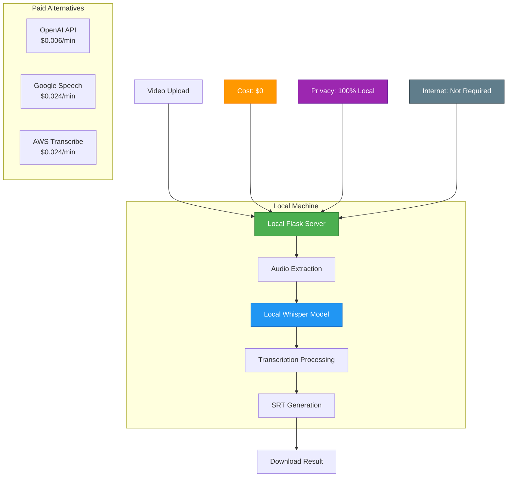
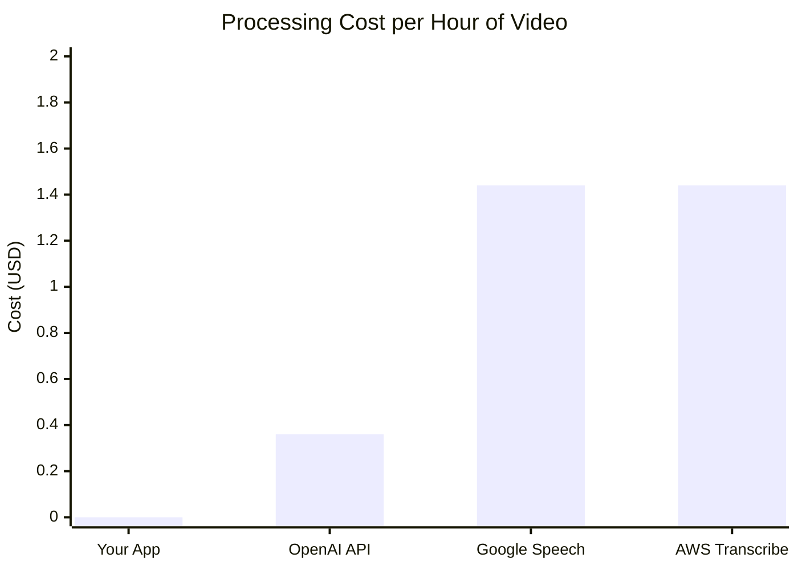

# Video Transcriber

Enterprise-grade video transcription service powered by OpenAI Whisper AI models. Transform video content into accurate, timestamped subtitles with professional-grade precision.


## Overview

Video Transcriber is a production-ready web application that leverages cutting-edge AI technology to provide accurate, automated video transcription services. Built for scalability and reliability, it supports multiple video formats and languages while maintaining enterprise-level security and performance standards.

## Key Features

### Advanced AI Processing
- **OpenAI Whisper Integration**: Utilizes state-of-the-art speech recognition models
- **Multi-Model Support**: Six precision levels from lightweight to maximum accuracy
- **Automatic Language Detection**: Intelligent language identification across 9+ languages
- **Real-time Processing**: Live progress tracking with detailed status updates

### Enterprise-Ready Infrastructure
- **Scalable Architecture**: Flask-based backend with async processing
- **File Management**: Secure upload handling with automatic cleanup
- **Format Compatibility**: Support for MP4, MOV, AVI, MKV, WebM formats
- **Output Standards**: Industry-standard SRT subtitle generation

## Features

- **Zero API Costs**: Runs completely offline using local Whisper models
- **Multi-Format Support**: MP4, MOV, AVI, MKV, WebM (up to 500MB)
- **Multiple Whisper Models**: From `tiny` (39MB) to `large-v2` (1.5GB)
- **Multi-Language**: Supports 10+ languages with auto-detection
- **Professional Output**: Industry-standard SRT subtitle files
- **Modern Interface**: Responsive web UI with drag-and-drop upload
- **Real-Time Progress**: Live transcription status and progress tracking
- **Background Processing**: Asynchronous job handling
- **CLI Support**: Command-line interface for automation
- **Privacy First**: All processing happens locally on your machine

## Cost-Free Architecture



## Cost Comparison



## Installation

### System Requirements
- Python 3.8 or higher
- FFmpeg (for audio processing)
- 4GB RAM minimum (8GB recommended for large models)
- 2GB available disk space

### Production Deployment

```bash
# Clone the repository
git clone <repository-url>
cd video_transcriber_app

# Create virtual environment
python3 -m venv venv
source venv/bin/activate  # On Windows: venv\Scripts\activate

# Install dependencies
pip install -r requirements.txt

# Launch production server
python3 flask_app.py
```

### Dependencies
```
flask>=3.1.1
openai-whisper>=20230314
moviepy>=1.0.3
torch>=2.0.0
numpy>=1.24.0
ffmpeg-python>=0.2.0
werkzeug>=3.1.0
```

## Usage

### Web Interface

1. **Start the Service**
   ```bash
   python3 flask_app.py
   ```

2. **Access Dashboard**
   Navigate to `http://localhost:5001`

3. **Upload Content**
   - Drag and drop video files or use the upload button
   - Supported formats: MP4, MOV, AVI, MKV, WebM
   - Maximum file size: 500MB

4. **Configure Processing**
   - Select Whisper model based on accuracy requirements
   - Choose target language or enable auto-detection

5. **Monitor Progress**
   - Real-time processing status
   - Detailed progress indicators
   - Estimated completion time

6. **Download Results**
   - Preview generated subtitles
   - Download SRT files
   - Copy text content

### Command Line Interface

```bash
# Basic transcription
python3 cli_app.py input_video.mp4

# Advanced configuration
python3 cli_app.py input_video.mp4 \
  --model medium \
  --lang en \
  --output subtitles.srt

# Direct module usage
python3 transcriber.py video.mp4 --model large-v2 --lang auto

## Model Specifications

| Model | Size | Processing Speed | Accuracy | Memory Usage | Recommended Use Case |
|-------|------|------------------|----------|--------------|----------------------|
| `tiny` | 39 MB | Very Fast | Basic | 1 GB | Development/Testing |
| `base` | 74 MB | Fast | Good | 1 GB | General Purpose |
| `small` | 244 MB | Moderate | High | 2 GB | Production Ready |
| `medium` | 769 MB | Slow | Very High | 5 GB | High Accuracy Required |
| `large` | 1550 MB | Very Slow | Excellent | 10 GB | Maximum Precision |
| `large-v2` | 1550 MB | Very Slow | Best Available | 10 GB | Enterprise Grade |

## Supported Languages

The system supports automatic transcription in the following languages:

- **Portuguese** (`pt`) - Português
- **English** (`en`) - English
- **Spanish** (`es`) - Español
- **French** (`fr`) - Français
- **German** (`de`) - Deutsch
- **Italian** (`it`) - Italiano
- **Japanese** (`ja`) - 日本語
- **Korean** (`ko`) - 한국어
- **Chinese** (`zh`) - 中文
- **Auto-Detection** (`auto`) - Automatic language identification

## Architecture

```
video_transcriber_app/
├── flask_app.py          # Main Flask web application
├── transcriber.py        # Core transcription engine
├── cli_app.py           # Command-line interface
├── requirements.txt     # Python dependencies
├── templates/
│   └── index.html      # Web interface template
├── uploads/            # Temporary file storage
├── results/            # Generated SRT outputs
├── LICENSE             # Apache 2.0 license
└── README.md           # Documentation
```

## Performance Metrics

### Processing Benchmarks

| Video Length | Model | Processing Time | Memory Usage | CPU Utilization |
|--------------|-------|-----------------|--------------|------------------|
| 10 minutes | `base` | 2-3 minutes | 1-2 GB | 60-80% |
| 10 minutes | `medium` | 4-6 minutes | 3-5 GB | 70-90% |
| 10 minutes | `large-v2` | 8-12 minutes | 8-10 GB | 80-95% |
| 60 minutes | `base` | 12-18 minutes | 1-2 GB | 60-80% |
| 60 minutes | `large-v2` | 45-70 minutes | 8-10 GB | 80-95% |

### System Optimizations

- **Asynchronous Processing**: Background job handling with real-time status updates
- **Memory Management**: Automatic cleanup of temporary files and model caching
- **Audio Optimization**: Intelligent audio compression for faster processing
- **Multi-threading**: Parallel processing capabilities for improved performance
- **Resource Monitoring**: Built-in system resource tracking and management

## Configuration

### Environment Variables

```bash
# Model and cache configuration
export WHISPER_CACHE_DIR="/path/to/cache"    # Model cache directory
export MAX_FILE_SIZE="500"                   # Maximum file size in MB
export FLASK_PORT="5001"                     # Server port
export FLASK_ENV="production"                # Environment mode
export WORKERS="4"                           # Number of worker processes
```

### Application Settings

```python
# Flask configuration
app.config['MAX_CONTENT_LENGTH'] = 500 * 1024 * 1024  # 500MB limit
app.config['UPLOAD_FOLDER'] = 'uploads'                # Upload directory
app.config['RESULTS_FOLDER'] = 'results'               # Output directory
app.config['SECRET_KEY'] = 'your-secret-key'           # Security key
```

## Troubleshooting

### Common Issues

#### FFmpeg Installation Error
```bash
# macOS
brew install ffmpeg

# Ubuntu/Debian
sudo apt update && sudo apt install ffmpeg

# CentOS/RHEL
sudo yum install ffmpeg

# Windows
# Download from https://ffmpeg.org/download.html
# Add to system PATH
```

#### Memory Issues with Large Models
- **Solution**: Use smaller models (`tiny`, `base`, `small`) for resource-constrained environments
- **Optimization**: Close unnecessary applications to free memory
- **Hardware**: Consider GPU acceleration for large models
- **Monitoring**: Check system resources before processing

#### File Size Limitations
- **Compression**: Use video compression tools (HandBrake, FFmpeg)
- **Segmentation**: Split large videos into smaller chunks
- **Format Optimization**: Convert to efficient formats (MP4 with H.264)
- **Quality Settings**: Reduce video quality while maintaining audio clarity

#### Transcription Accuracy Issues
- **Model Selection**: Use larger models (`medium`, `large-v2`) for better accuracy
- **Language Specification**: Explicitly set the correct language code
- **Audio Quality**: Ensure clear audio without background noise
- **Preprocessing**: Clean audio using noise reduction tools

## Contributing

We welcome contributions from the community. To contribute:

1. **Fork the Repository**
   ```bash
   git clone https://github.com/your-username/video-transcriber.git
   ```

2. **Create Feature Branch**
   ```bash
   git checkout -b feature/enhancement-name
   ```

3. **Implement Changes**
   - Follow existing code style and conventions
   - Add appropriate tests for new functionality
   - Update documentation as needed

4. **Submit Pull Request**
   ```bash
   git commit -m "Add: detailed description of changes"
   git push origin feature/enhancement-name
   ```

### Development Guidelines

- **Code Quality**: Maintain high code quality with proper error handling
- **Testing**: Include unit tests for new features
- **Documentation**: Update README and inline documentation
- **Performance**: Consider performance implications of changes

## Release Notes

### Version 1.0.0 (2025-01-27)

**New Features**
- Flask-based web interface with responsive design
- Drag-and-drop file upload functionality
- Real-time processing progress tracking
- Multi-format video support (MP4, MOV, AVI, MKV, WebM)
- SRT subtitle file generation and download
- Multiple Whisper model options
- Automatic language detection
- Command-line interface for batch processing

**Technical Improvements**
- Asynchronous background processing
- Automatic temporary file cleanup
- Memory optimization for large files
- Multi-threading support

## License

This project is licensed under the Apache License 2.0. See the [LICENSE](LICENSE) file for details.

## Acknowledgments

- **OpenAI** for the Whisper speech recognition models
- **MoviePy** for video processing capabilities
- **Flask** for the web framework
- **FFmpeg** for multimedia processing

## Support

For technical support and inquiries:

- **Issues**: Report bugs and request features via GitHub Issues
- **Documentation**: Comprehensive guides available in the repository
- **Community**: Join discussions in the project repository

## Enterprise Support

For enterprise deployments, custom integrations, or commercial licensing:

- **Professional Services**: Custom development and integration support
- **SLA Options**: Service level agreements for production deployments
- **Training**: Team training and onboarding services
- **Consulting**: Architecture and optimization consulting

---

**Built with Python and AI • Enterprise Ready • Apache 2.0 Licensed**
